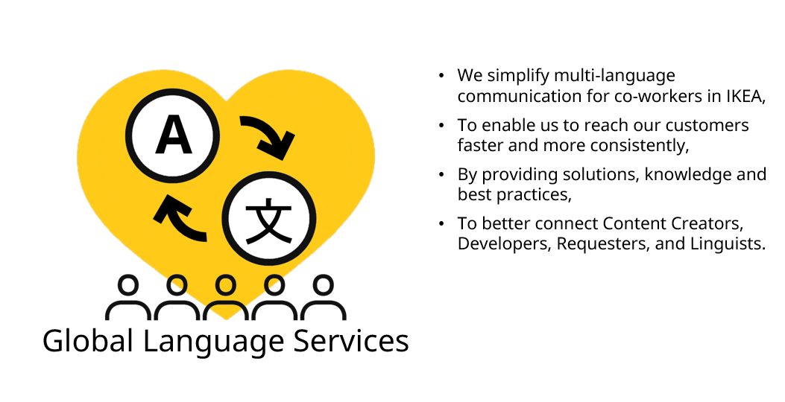

# Global Translation Services Chatbot

Welcome to the Translation Services Chatbot! This chatbot is designed to assist you with all your translation needs. Whether you need help translating a document, understanding a foreign language phrase, or finding professional translation services, this chatbot is here to provide you with the necessary information and support.

## Features

Language Translation: The chatbot can translate text from one language to another. Simply provide the source text and the desired target language, and the chatbot will generate the translated version for you.

Phrase Translation: If you come across a foreign phrase that you need assistance with, the chatbot can help you understand its meaning and provide a translation in your preferred language.

Professional Translation Services: The chatbot can provide recommendations and information about professional translation services. Whether you need a document translated, a website localized, or an interpreter for a business meeting, the chatbot can guide you in finding the right service provider.

Language Learning Resources: If you're interested in learning a new language, the chatbot can suggest language learning resources, such as websites, apps, and courses, to help you get started on your language learning journey.

Frequently Asked Questions: The chatbot is equipped with a database of frequently asked questions related to translation services. It can provide instant answers to common inquiries, saving you time and effort.

## Usage

To interact with the Translation Services Chatbot, follow these steps:

Type your question or request in the chat window.
The chatbot will analyze your input and provide relevant responses or ask for additional information if needed.
If you want to translate text, simply provide the source text and specify the target language.
If you need help understanding a phrase, enter the phrase, and the chatbot will provide a translation and explanation.
If you require information about professional translation services, describe your needs, and the chatbot will offer suitable recommendations.
For language learning resources, ask the chatbot for suggestions based on your target language.
Example Conversations
User: Can you translate "Hello, how are you?" to French?

Chatbot: Sure! The translation for "Hello, how are you?" in French is "Bonjour, comment ça va?"

User: I need a professional translator for a legal document. Can you recommend any services?

Chatbot: Absolutely! There are several reliable translation services available for legal documents. Some reputable options include XYZ Translation Services and ABC Translations. They have extensive experience in legal translations and offer high-quality results. I recommend reaching out to them for further assistance.

User: I'm interested in learning Spanish. Do you have any recommended resources?

Chatbot: Of course! There are many great resources for learning Spanish. Some popular options include Duolingo, Rosetta Stone, and Babbel. Additionally, you may find online courses on platforms like Coursera and Udemy. These resources offer interactive lessons, exercises, and pronunciation practice to help you improve your Spanish skills.

## Feedback

We appreciate your feedback on the Translation Services Chatbot. If you have any suggestions for improvement or encounter any issues, please let us know. Your feedback will help us enhance the chatbot's functionality and user experience.

Thank you for using the Translation Services Chatbot!
